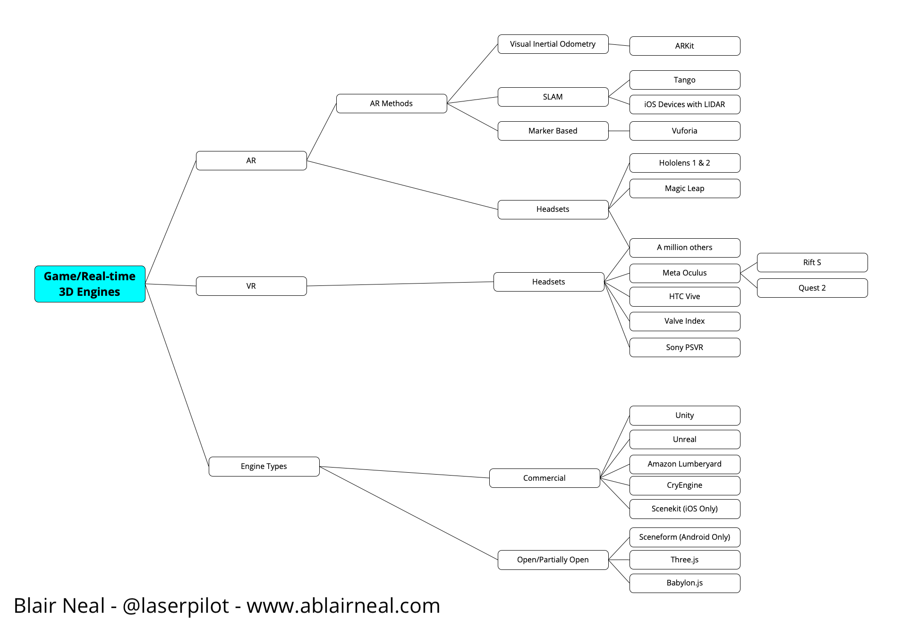
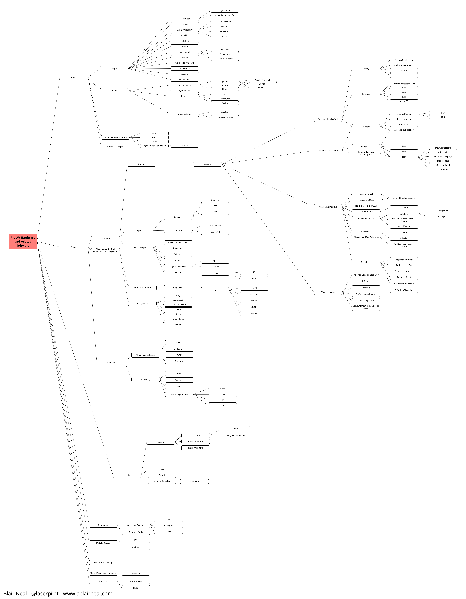
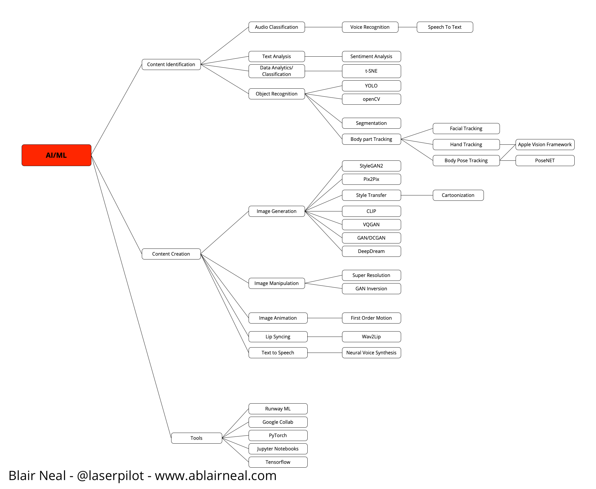
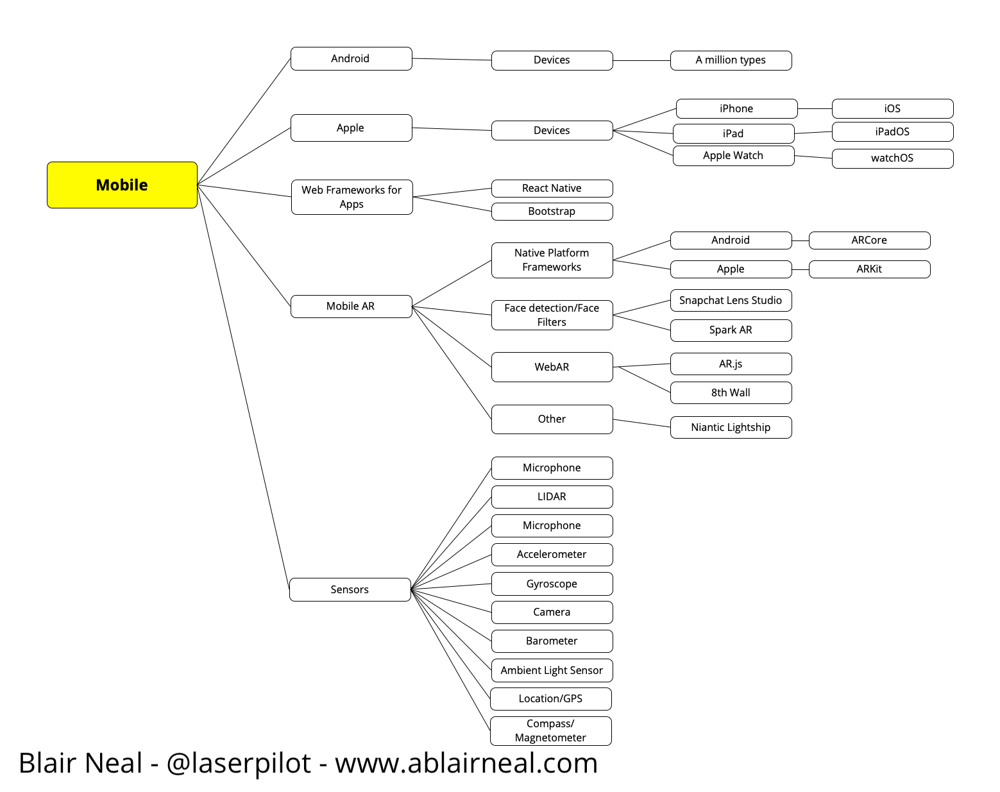
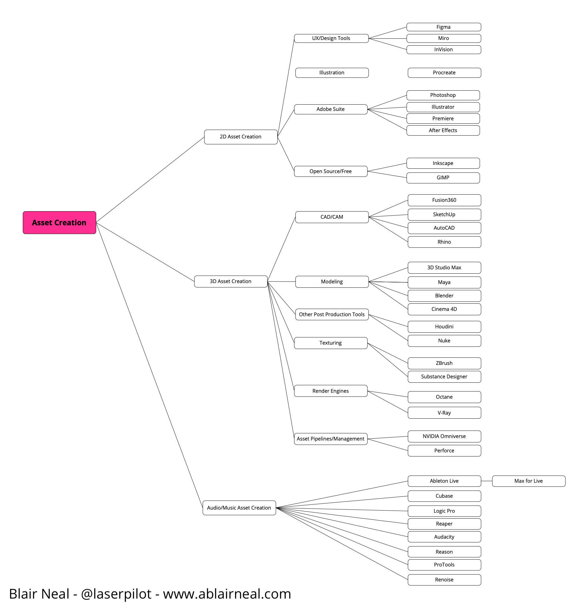
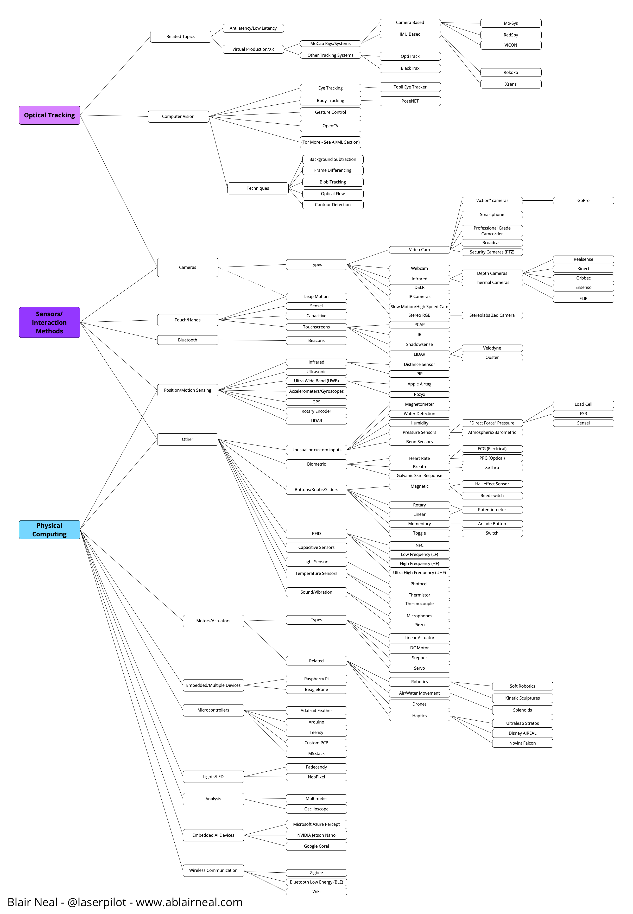

# Creative Tech Taxonomy

Link to Github pages is here

 An open taxonomy of software, hardware, and concepts related to creative technology and creative coding. Many relationships and hierarchies between topics are completely subjective and have many flaws, so please don't take these too seriously - if you have a correction or suggestion, please submit a pull request. This is a labor of love and not meant to be too prescriptive, just illustrative.

 This was created because taxonomies for this undefined space are important tools for developing a common language and grammar to better enable communication and education. Read more of my longwinded thoughts on all that in my post [here](https://ablairneal.com/a-creative-technology-taxonomy).

 Originally created as a visual map [here](https://twitter.com/laserpilot/status/1104056855528128513/photo/1). 
 
 I later adapted this idea to a JSON structure for easy modification and portability to other environments. 

 This is currently in an early state, so please submit suggestions for data formats, or feel free to jump in and help with the rote work of filling in things like links/information/tags/etc. 

The diagram was originally made as a static image, but @HeidiHe made some huge improvements [in this repo](https://github.com/HeidiHe/Experiment_Repo_on_CreativeTech_Taxonomy) and now we can run this on a github pages or locally so that it can be visualized. 

Once you have the repo, you can run the page locally from the root of this directory with any method you choose -here is a starter command if you have `http-server` installed:

`http-server -a localhost -p 8000 -c-1`

## Future Improvements - 

Adding a contextual information system that can display additional info about the clicked node:
 Current proposed format is something like this:

 - **Parent Node**
    -   **Child Node**: Named the same name
        - **DisplayText**: Name of the Node. Could eventually be an array with different languages
        - **InfoLink**: If relevant, a link to a website with more info
        - **Tags**: Array of text that could be useful for creating visualizations that create other connections between points
            - **Child Node**: other subcategories below this child

Example:
 - Creative Code Frameworks (parent)
    - C++ (child)
        - OpenFrameworks (child)
            - DisplayText: OpenFrameworks
            - Infolink: www.openframeworks.cc
            - Tags:
                - C++
                - Open Source
                - Creative Code Framework
                - Mac
                - Windows
                - Linux

Other eventual additions:
 - Might need a different format to better capture parent/child relationships. Also needs a way to assign multiple parents to one child node to eliminate confusion
 - Unique ID per node or a way to relate the same "node" in multiple locations
 - Description as part of the node
 - Parent node as part of the child description

 Other category additions for the future?
  - Organizations/Companies/Collectives/Art Institutes and the tools they use?
  - Well known works and related tools?
  - Improve Mobile, Game Engine, Web, and AI section classification and depth

For another really great taxonomy document, check out this link: https://github.com/terkelg/awesome-creative-coding

Individual Images:

